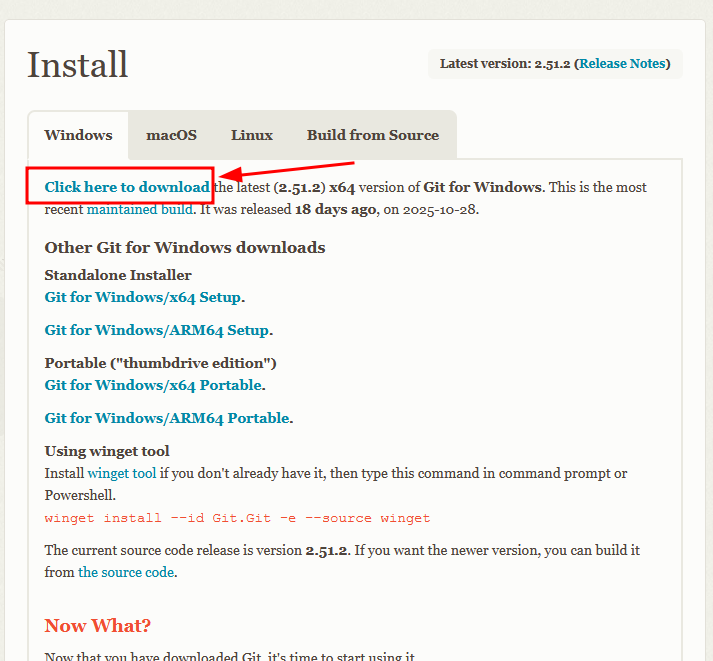

# Installing Prerequisites
The following software packages must be installed on your system. All are free
and require no accounts.

## Installing Git
For Debian/Ubuntu/etc:
```bash
sudo apt install git
```

For other distros use your prefered package manager or acquire the program from
here: [https://git-scm.com/](https://git-scm.com/)

<details closed>
<summary>Installing Git for Windows</summary>
    
### Installing Git for Windows
Download and install Git for windows.



See the following gif for details if you are confused.

<div class="video-card">
  <video controls style="width: 100%; height: auto;" poster="../_static/gifs/demo_preview.gif">
    <source src="../_static/videos/gitbash_install.webm" type="video/webm">
  </video>
</div>
<br>
</details>

## Installing Docker Engine
For Ubuntu/Debian follow the excellent instructions here:
[https://docs.docker.com/engine/install/ubuntu/](https://docs.docker.com/engine/install/ubuntu/)

<details closed>
<summary>Installing Docker Desktop for windows</summary>
For windows Docker engine is not made available seperately. It is necssary to install the
*Docker Desktop* package which includes as a component the docker engine. WSL2
must be configured and available. See the following resource for instructions:
    
[https://docs.docker.com/desktop/setup/install/windows-install/](https://docs.docker.com/desktop/setup/install/windows-install/)
</details>


## Installing VSCode/VSCodium
Either VSCodium (open source build of VSCode) or VSCode will work. 

To install VSCodium for Ubuntu/Debian follow the instructions here:

[https://vscodium.com/#install-on-debian-ubuntu-deb-package](https://vscodium.com/)

To install VSCode for Ubuntu/Debian follow the instructions here:

[https://code.visualstudio.com/docs/setup/linux#_install-vs-code-on-linux](https://code.visualstudio.com/docs/setup/)

<details closed>
<summary>Installing VSCode/VSCodium for windows</summary>
<div class="video-card">
  <video controls style="width: 100%; height: auto;" poster="../_static/gifs/demo_preview.gif">
    <source src="../_static/videos/win_vs_install.webm" type="video/webm">
  </video>
</div>

