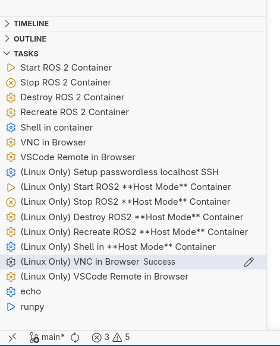

# Using The ROS2 Demo Container
The ros2-demo container *image* will give you a functioning Ubuntu-ROS2 environment.
A container made using this image will work on both Linux and windows.

There are several options for how you can start/stop and connect to your ros2
container.

A `.vscode/tasks.json` file has been placed in the the repo to provide you with
helpful buttons which will appear in VSCode under "TASKS". See the below
screenshots for details.

Equivalent text shell commands will also be provided. A Makefile for linux users
is also available.

## Checking System Prerequisites
To check that all dependendices are correctly installed run the following commands in a text shell:
```bash
docker --version
docker compose version
git --version
```

Expected output:
```text
Docker version 29.5.1, build 2518b52d94
Docker Compose version 5.1.3
git version 2.54.0
```


## Starting the ros2-demo Container
**To start, run the VSC task "Start ROS2 Container"** as shown in the picture
below. This will pull [the prebuilt Ubuntu container
image](https://hub.docker.com/repository/docker/n97b2m/ros2-reu-demo/tags) with
ros2 and the demonstration code.



A video of the same process:
 <div style="max-width: 100%; overflow-x: auto;">
  <video controls style="width: 100%; height: auto;" poster="../_static/gifs/demo_preview.gif">
    <source src="../_static/videos/task-start-shell.webm" type="video/webm">
  </video>
</div> 


<details closed>
<summary>Starting ros2-demo container with docker compose CLI</summary>
    
```bash
    docker pull n97b2m/ros2-reu-demo:v0.1
    docker compose -f .container/compose.yml up ros2-demo
```
</details>

## Getting a Shell in the Container
Run the task "Shell in container". This will open a shell in the integrated
terminal of VSC. See the above video for this step as well.

TODO: video


## Getting a Graphical Desktop
This can be done using the VNC connection available on a localhost port. **Run
the task "VNC in Browser"**. See video for details.

 <div style="max-width: 100%; overflow-x: auto;">
  <video controls style="width: 100%; height: auto;" poster="../_static/gifs/demo_preview.gif">
    <source src="../_static/videos/task-vnc-long-browser.webm" type="video/webm">
  </video>
</div> 

## Connecting VSC to Container
It is possible to use the copy of VSC on your computer, but if you do this it
many of the language features will not be available since the ros2 packages are
not present except for in the container.

Two options exist for running VSC "in" the ros2-demo container:
* Connecting your local VSC instance over SSH to the container (preferred)
* As a browser accessble remote code-server

### Connecting your local VSC instance over SSH to the container (preferred)
TODO: video

### As a browser accessble remote code-server
<div style="max-width: 100%; overflow-x: auto;">
  <video controls style="width: 100%; height: auto;" poster="../_static/gifs/demo_preview.gif">
    <source src="../_static/videos/task-vsc-browser.webm" type="video/webm">
  </video>
</div> 

## SSH'ing Into the Container
The container binds to a localhost port 2223 by default with a user robot and a
password of robot. This won't be accessible to others on the subnet since the
container is in "bridge" network mode.

TODO: Video

## Running Container in "host" Network Mode
When running in "host" network mode the ros2 container can control real robots
and see ros2 traffic from other hosts on the network. Possibly works for
windows, someone should check!

Note: In this mode the novnc and ssh server are still restricted to localhost but now at
ports 6080 and 2222 respectively. 

To use this mode run the task "(Linux Only) Start ROS2 **Host Mode** Container".

TODO: Video
